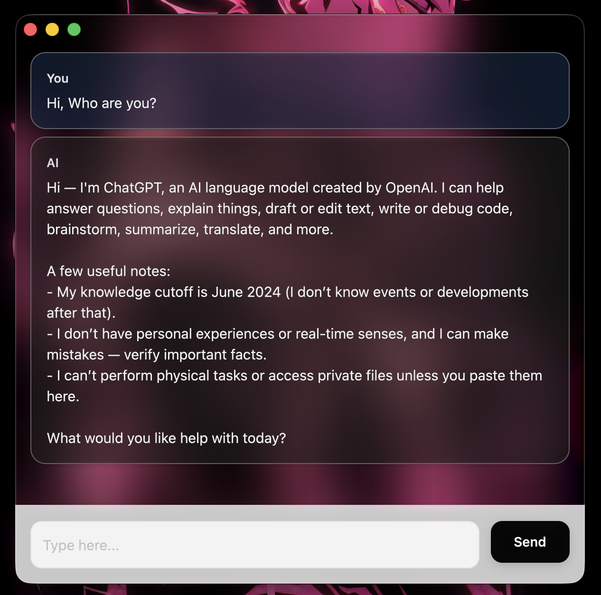

# ChatUI

A native macOS chat application built with Rust and GPUI for chatting with OpenAI's API.



## Features

- **Native Performance**: Built with GPUI for native macOS performance and appearance
- **Clean Interface**: Modern translucent interface with blurred background effects
- **Robust Error Handling**: Proper error propagation and user feedback
- **Thread-Safe Architecture**: Message identification prevents race conditions during concurrent operations

## Prerequisites

- Rust 1.70+ (latest stable recommended)
- macOS 10.15+
- OpenAI API key

## Installation

1. Clone the repository:
```bash
git clone <repository-url>
cd chatui
```

2. Create a `.env` file in the project root:
```bash
echo "OPENAI_API_KEY=your-api-key-here" > .env
```

3. Build and run:
```bash
cargo run --release
```

## Architecture

### Core Components

- **ChatWindow**: Main UI component managing message display and user interactions
- **TextInput**: Custom text input with full editing capabilities (selection, clipboard, IME support)
- **OpenAIClient**: HTTP client for streaming API responses
- **Message System**: Stable ID-based message tracking prevents race conditions

### Key Design Decisions

**Stable Message IDs**: Each message receives a unique, monotonically increasing ID to avoid issues with index-based lookups during concurrent operations.

**Pre-allocated Buffers**: String capacity pre-allocation (2KB) minimizes reallocations during responses.

**Graceful Degradation**: The application continues to function even if the window closes during API calls, with proper cleanup and error logging.

## Configuration

### Constants (`src/ui/chat_window.rs`)

```rust
const MAX_MESSAGES: usize = 200;  // Message history limit
```

### Theme (`src/ui/theme.rs`)

Color palette can be customized by modifying the rgba values:
- User messages: Deep navy blue (`0x1E3A5F70`)
- AI messages: Dark gray (`0x2D2D2D68`)

## Keyboard Shortcuts

- `Enter` - Send message
- `Cmd+A` - Select all text
- `Cmd+C/V/X` - Copy/Paste/Cut
- `Cmd+Q` - Quit application
- `Ctrl+Cmd+Space` - Character palette

## Development

### Project Structure

```
chatui/
├── src/
│   ├── api/
│   │   ├── client.rs      # OpenAI API client
│   │   └── mod.rs
│   ├── ui/
│   │   ├── chat_window.rs # Main chat interface
│   │   ├── input_box.rs   # Text input component
│   │   ├── theme.rs       # Color definitions
│   │   └── mod.rs
│   ├── message.rs         # Message data structures
│   └── main.rs            # Application entry point
├── Cargo.toml
└── .env
```

### Building for Release

```bash
cargo build --release
```

The binary will be located at `target/release/chatui`.

### Running Tests

```bash
cargo test
```

## Error Handling

Errors are logged to stderr with context:
- Network failures during API requests
- Window closure during active streaming
- Clipboard operation failures

All errors include descriptive messages for debugging.

## Performance Characteristics

- **Memory**: ~50MB baseline (GPUI framework overhead)
- **Message Limit**: 200 messages (configurable)
- **UI Thread**: Non-blocking async architecture

## Known Limitations

- macOS only (GPUI constraint)
- Single conversation thread
- No message persistence
- Maximum 200 message history

## Contributing

1. Fork the repository
2. Create a feature branch
3. Ensure `cargo fmt` and `cargo clippy` pass
4. Submit a pull request

## Troubleshooting

**Application won't start:**
- Verify `OPENAI_API_KEY` is set in `.env`
- Check API key validity

**Response fails to appear:**
- Check network connectivity
- Verify API quota/rate limits
- Review stderr for error messages

**UI appears blank:**
- Ensure macOS version compatibility (10.15+)
- Check display permissions
